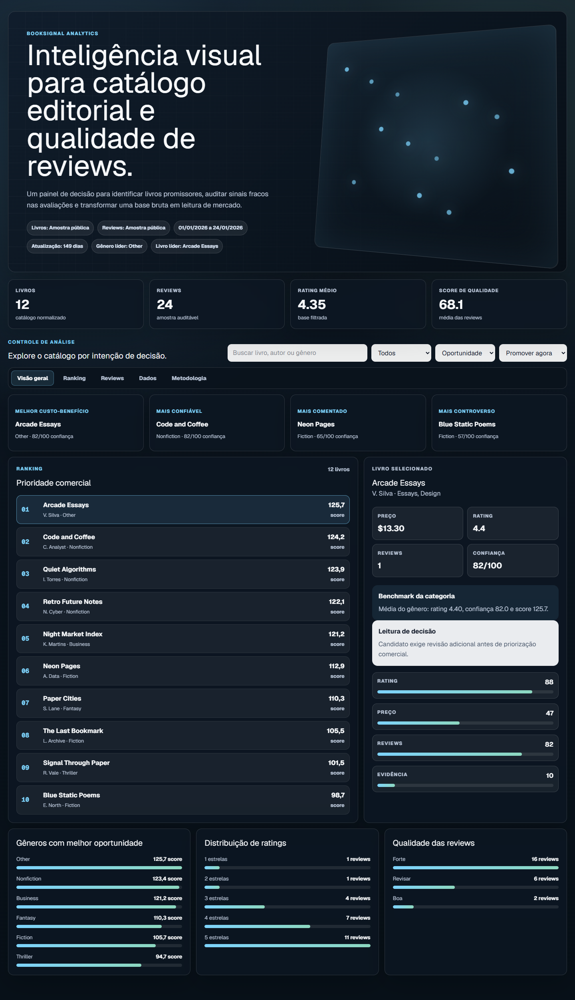

# BookSignal Analytics

BookSignal Analytics é um projeto de portfólio para análise de catálogo editorial. Ele combina metadados de livros, preço, rating e sinais de qualidade de reviews em um dashboard estático preparado para GitHub Pages.

O projeto tem duas camadas:

- um pipeline Python que limpa CSVs e exporta um contrato JSON;
- uma interface em Next.js que apresenta ranking, qualidade das reviews, benchmarks por categoria e checagens de qualidade da base.

## Interface

O dashboard é organizado em cinco visões:

- `Visão geral`: resumo executivo, cards de oportunidade e detalhe do livro selecionado.
- `Ranking`: catálogo filtrado por intenção de decisão.
- `Reviews`: evidências recentes do livro selecionado.
- `Dados`: distribuições agregadas e qualidade da base.
- `Metodologia`: interpretação do score, limites e requisitos de fonte.

As imagens abaixo foram capturadas a partir do build estático de produção.



Versão mobile:


## Perguntas Que O Projeto Responde

- Quais livros são bons candidatos para promoção ou curadoria?
- Quais livros têm boas notas, mas evidência fraca nas reviews?
- Quais gêneros mostram melhor relação entre preço, rating e qualidade das reviews?
- A base analisada é completa o bastante para sustentar a leitura?

## Estrutura

```text
.
├── analytics/
│   └── export_booksignal.py        # Gera o JSON do dashboard
├── datasets/
│   ├── booksignal/                 # Funções Python de análise
│   ├── sample_books.csv
│   └── sample_reviews.csv
├── docs/
│   ├── ARQUITETURA.md
│   ├── METODOLOGIA.md
│   └── CHECKLIST_PUBLICACAO.md
├── scripts/
│   └── validate.ps1
├── tests/
│   ├── test_analysis.py
│   └── test_export_booksignal.py
└── web/
    ├── src/app/
    ├── src/components/dashboard.tsx
    └── src/data/booksignal.json
```

## Stack

- Python e Pandas para preparação dos dados.
- Next.js, React e TypeScript para a interface.
- Export estático para GitHub Pages.
- GitHub Actions para testes, lint, typecheck e publicação.

## Como Rodar

Instale as dependências Python:

```bash
pip install -r requirements.txt
```

Gere os dados do dashboard:

```bash
python analytics/export_booksignal.py
```

Rode a interface:

```bash
cd web
npm install
npm run dev
```

Abra `http://localhost:3000`.

## Validação

Testes Python:

```bash
python -m unittest discover -s tests -p "test_*.py"
```

Checks do frontend:

```bash
cd web
npm run lint
npm run typecheck
npm run build
```

Validação completa no Windows:

```powershell
.\scripts\validate.ps1
```

## GitHub Pages

O app Next.js está configurado para export estático. Para simular um build local com o caminho do repositório:

```powershell
.\scripts\validate.ps1 -BasePath "/NOME_DO_REPOSITORIO" -SiteUrl "https://USUARIO.github.io/NOME_DO_REPOSITORIO"
```

O artefato final é gerado em `web/out`.

O workflow `.github/workflows/pages.yml` executa exportação dos dados, testes Python, lint, typecheck e build estático antes de publicar no GitHub Pages.

## Observações Sobre Dados

O repositório inclui CSVs de amostra para demonstração. Bases brutas de terceiros não devem ser commitadas sem licença, permissão de uso e revisão de privacidade.

O score de qualidade das reviews é uma heurística local. Ele destaca evidências fracas, como texto curto, review não verificada e rating extremo, mas não deve ser interpretado como detecção de fraude.

## Documentação

- [Arquitetura](docs/ARQUITETURA.md)
- [Metodologia](docs/METODOLOGIA.md)
- [Checklist de publicação](docs/CHECKLIST_PUBLICACAO.md)
